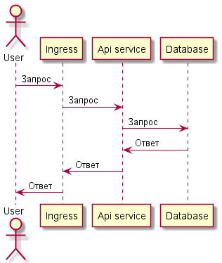

Prometheus. Grafana 

📚 Домашнее задание/проектная работа разработано(-на) для курса "[Microservice Architecture](https://otus.ru/lessons/microservice-architecture/)"

## Описание
Используется стандартная архитектура для веб-приложения, 
состоящая из клиента (веб-браузера), RestFull API сервиса и базы данных.

Для аутентификации используется  JWT



## Запуск

```
minikube start
minikube addons enable ingress

# namespace: default
kubectl apply -f manifest
```

## Проверка
```
newman run otus.postman_collection.json
```


