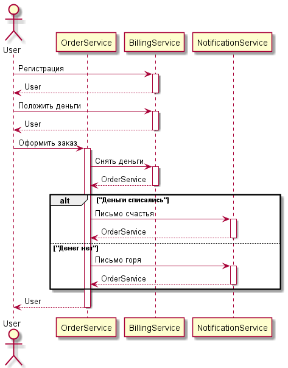
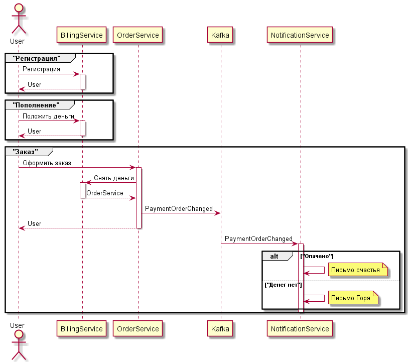
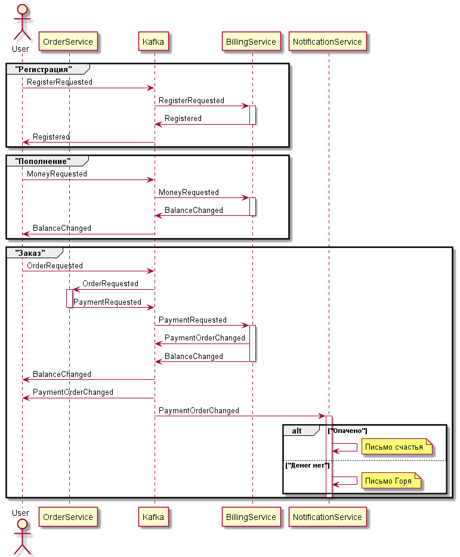

## Паттерны поддержания консистентности данных (Stream processing) 

📚 Домашнее задание/проектная работа разработано(-на) для курса "[Microservice Architecture](https://otus.ru/lessons/microservice-architecture/)"

### HTTP взаимодействие

### Событийное взаимодействие с использование брокера сообщений для нотификаций

### Event Collaboration

## Выбранный вариант
Сначала строил бы систему через Request-reply. 
По мере роста проекта и нагрузок переходил бы к событийному взаимодействию и Event Collaboration 